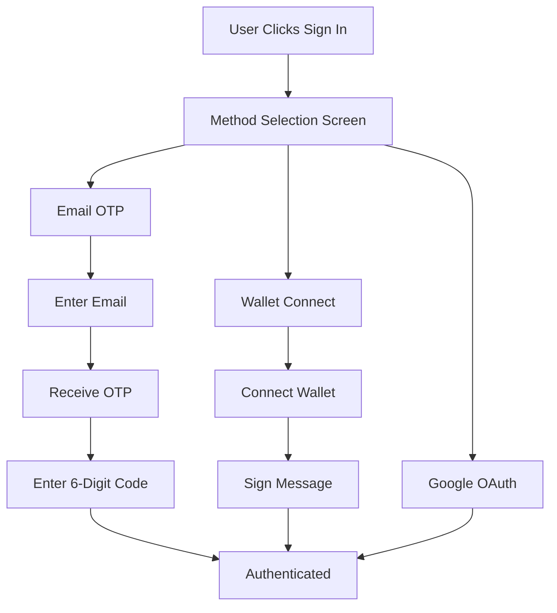

# PNGX Authentication UX Design

## Overview

PNGX implements a modern, passwordless authentication system with two primary methods:
1. **Email + OTP** (One-Time Password) - Passwordless email verification
2. **Web3 Wallet** - Blockchain wallet signature authentication

## Authentication Flow



## User Journey

### Journey 1: Email OTP Authentication

**Step 1: Method Selection**
- User sees three options:
  - "Continue with Email" (primary button)
  - "Connect Wallet" (gradient button)
  - "Continue with Google" (outline button)
- Clean, minimal UI with clear visual hierarchy

**Step 2: Email Input**
- User enters email address
- Large, touch-friendly input field (h-12)
- "Send OTP" button
- Back button to return to method selection
- Helper text: "We'll send a 6-digit code to verify your email"

**Step 3: OTP Verification**
- 6-digit OTP input with individual slots
- Auto-focus on first slot
- Auto-advance between slots
- "Resend code" link
- "Verify & Sign In" button (disabled until 6 digits entered)
- Back button to re-enter email

**Step 4: Success**
- User is authenticated
- Modal closes
- User menu appears in header with avatar

### Journey 2: Wallet Authentication

**Step 1: Method Selection**
- User clicks "Connect Wallet"

**Step 2: Wallet Connection**
- Informational card explaining Web3 authentication
- Visual: Gradient circle with sparkles icon
- "Connect Wallet" button (gradient)
- Helper text: "Supports MetaMask, WalletConnect, Coinbase Wallet, and more"
- Back button to method selection

**Step 3: Wallet Signature**
- RainbowKit modal appears
- User selects wallet provider
- User signs message to prove ownership
- No password needed

**Step 4: Success**
- User is authenticated
- Modal closes
- User menu shows wallet address (truncated)

## UI Components

### Method Selection Screen
```tsx
- Title: "Welcome to PNGX"
- Description: "Choose your preferred sign-in method"
- Buttons:
  * Email (default variant, h-14)
  * Wallet (gradient, h-14)
  * Google (outline, h-12)
- Footer: Terms & Privacy notice
```

### Email Input Screen
```tsx
- Title: "Sign in with Email"
- Description: "We'll send a one-time password to your email"
- Back button
- Email input (h-12, autofocus)
- Send OTP button (h-12)
- Helper text
```

### OTP Verification Screen
```tsx
- Title: "Enter OTP"
- Description: "Enter the 6-digit code sent to {email}"
- Back button
- 6-slot OTP input (centered)
- Resend link
- Verify button (h-12, disabled until complete)
```

### Wallet Connection Screen
```tsx
- Title: "Connect Wallet"
- Description: "Connect your Web3 wallet to continue"
- Back button
- Info card with:
  * Icon (gradient circle)
  * Heading: "Web3 Authentication"
  * Description
- Connect button (gradient, h-12)
- Supported wallets text
```

## Security Features

### Email OTP
- **6-digit code** - Secure and user-friendly
- **Time-limited** - OTP expires after 10 minutes
- **Rate limiting** - Max 3 OTP requests per hour per email
- **Email verification** - Confirms email ownership
- **No password storage** - Eliminates password-related vulnerabilities

### Wallet Authentication
- **Signature-based** - User signs a message with private key
- **Non-custodial** - PNGX never has access to private keys
- **Nonce-based** - Prevents replay attacks
- **Chain-agnostic** - Works with any EVM wallet
- **Automatic account creation** - First-time wallet users get auto-created profiles

## Implementation Details

### Firebase Email Link Authentication
```typescript
// Send OTP
await sendSignInLinkToEmail(auth, email, {
  url: `${window.location.origin}/auth/verify`,
  handleCodeInApp: true,
});

// Verify OTP
if (isSignInWithEmailLink(auth, window.location.href)) {
  await signInWithEmailLink(auth, email, window.location.href);
}
```

### Wallet Authentication Flow
```typescript
// 1. Connect wallet (RainbowKit)
const { address } = useAccount();

// 2. Generate nonce
const nonce = generateNonce();

// 3. Sign message
const message = `Sign in to PNGX\nNonce: ${nonce}`;
const signature = await signMessage({ message });

// 4. Verify signature on backend
const verified = await verifySignature(address, signature, nonce);

// 5. Create/login user
if (verified) {
  await createOrLoginWalletUser(address);
}
```

## User Experience Principles

### 1. Progressive Disclosure
- Show only relevant information at each step
- Don't overwhelm with all options at once
- Guide users through a clear, linear flow

### 2. Clear Visual Hierarchy
- Primary action (Email) uses default button style
- Secondary action (Wallet) uses eye-catching gradient
- Tertiary action (Google) uses subtle outline

### 3. Helpful Feedback
- Loading states on all buttons
- Success/error toasts
- Descriptive helper text
- Clear error messages

### 4. Easy Navigation
- Back buttons on all sub-screens
- Modal can be closed at any time
- Flow resets when modal closes

### 5. Accessibility
- Large touch targets (h-12, h-14)
- Auto-focus on inputs
- Keyboard navigation support
- Screen reader friendly

## Mobile Optimization

- **Touch-friendly buttons** - Minimum 44px height
- **Large input fields** - Easy to tap and type
- **Responsive layout** - Adapts to small screens
- **Bottom sheet on mobile** - Native feel (future enhancement)

## Future Enhancements

1. **Biometric Authentication** - Face ID, Touch ID on mobile
2. **Social Login** - Twitter, GitHub, Discord
3. **Magic Link** - Click link in email to sign in (no OTP)
4. **Remember Device** - Stay signed in for 30 days
5. **Multi-Factor Authentication** - Optional 2FA for extra security
6. **Passkeys** - WebAuthn support for passwordless auth

## Analytics Events

Track these events for UX optimization:
- `auth_method_selected` - Which method user chose
- `otp_sent` - OTP email sent successfully
- `otp_verified` - User entered correct OTP
- `wallet_connected` - Wallet connection successful
- `auth_abandoned` - User closed modal without completing
- `auth_error` - Authentication failed

## Error Handling

### Email OTP Errors
- Invalid email format → "Please enter a valid email address"
- OTP send failed → "Failed to send OTP. Please try again"
- Invalid OTP → "Invalid code. Please check and try again"
- Expired OTP → "Code expired. Request a new one"

### Wallet Errors
- Wallet not installed → "Please install MetaMask or another Web3 wallet"
- User rejected → "Wallet connection cancelled"
- Network error → "Connection failed. Please try again"
- Signature failed → "Failed to sign message. Please try again"

## Testing Checklist

- [ ] Email OTP flow works end-to-end
- [ ] Wallet connection works with MetaMask
- [ ] Wallet connection works with WalletConnect
- [ ] Google OAuth works
- [ ] Back buttons navigate correctly
- [ ] Modal closes and resets state
- [ ] Loading states display correctly
- [ ] Error messages are clear
- [ ] Mobile responsive
- [ ] Keyboard navigation works
- [ ] Screen reader accessible
