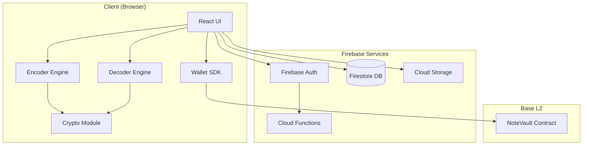

# PNGX - Architecture PRD

## Overview

PNGX is a secure file-to-image steganography platform with blockchain-backed note recovery.

---

## System Architecture



---

## Core Principles

| Principle | Implementation |
|-----------|----------------|
| **Privacy First** | All file processing client-side, never uploaded |
| **Zero Knowledge** | Server never sees plaintext files or notes |
| **Decentralized Recovery** | Blockchain backup, no central key escrow |
| **Progressive Enhancement** | Works without wallet, enhanced with Web3 |

---

## Component Architecture

### 1. Frontend (Next.js 14)
```
src/
├── app/                    # App Router pages
├── components/             # React components
├── lib/                    # Core libraries
│   ├── encoder/           # File → PNG
│   ├── decoder/           # PNG → File
│   ├── crypto/            # AES-256, PBKDF2
│   └── web3/              # Wallet integration
└── store/                  # Zustand state
```

### 2. Backend (Firebase)
- **Auth**: Email OTP, social OAuth
- **Firestore**: User profiles, history metadata
- **Storage**: Temporary share files (24h TTL)
- **Functions**: Admin APIs, cleanup jobs

### 3. Blockchain (Base L2)
- **NoteVault Contract**: Encrypted note storage
- **Events**: NoteStored, NoteDeleted for indexing

---

## Data Flow

### Encoding Flow
```
1. User selects file(s)
2. User enters security note (required) + password (optional)
3. Client generates:
   - Salt (16 bytes random)
   - IV (12 bytes random)
   - Key = PBKDF2(note + password, salt, 100k iterations)
4. Client encrypts: ciphertext = AES-GCM(file, key, iv)
5. Client builds header + ciphertext
6. Client renders to PNG via Canvas API
7. User downloads PNG
8. (Optional) Backup note to blockchain
9. Save metadata to Firestore history
```

### Decoding Flow
```
1. User uploads PNG
2. Client extracts header, validates signature "PX"
3. User enters security note + password
4. Client derives key with same PBKDF2 params
5. Client decrypts with AES-GCM
6. If auth tag fails → wrong note/password error
7. Client verifies SHA-256 hash
8. User downloads original file
```

---

## Security Model

| Layer | Protection |
|-------|------------|
| **Transport** | HTTPS everywhere |
| **Encryption** | AES-256-GCM (authenticated) |
| **Key Derivation** | PBKDF2 100k iterations |
| **Integrity** | SHA-256 hash verification |
| **Note Backup** | Wallet-signed encryption |
| **Session** | Firebase Auth JWT |
| **Admin** | Custom claims + IP whitelist |

---

## Infrastructure

| Service | Provider | Purpose |
|---------|----------|---------|
| Hosting | Vercel | Next.js SSR + Edge |
| Auth/DB | Firebase | Auth, Firestore, Storage |
| Blockchain | Base L2 | Note Vault contract |
| RPC | Alchemy/Infura | Blockchain access |
| Monitoring | Sentry | Error tracking |
| Analytics | PostHog | Privacy-friendly analytics |

---

## Scalability

| Concern | Strategy |
|---------|----------|
| File processing | Client-side, infinitely scalable |
| Auth/DB | Firebase auto-scales |
| Share storage | Cloud Storage with TTL cleanup |
| Blockchain | L2 handles throughput |
