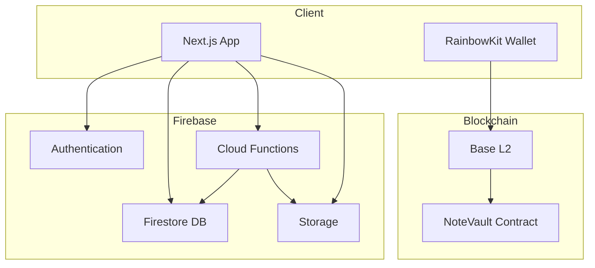

# Stage 1.5: Backend & Advanced Features Implementation Plan

## Overview
This plan covers the implementation of user management, admin backend, and wallet integration features that were designed in the PRDs but not yet implemented in Stage 1.

## Architecture Summary



## Implementation Phases

### Phase 1: Firebase Setup & Authentication (Priority: HIGH)

#### 1.1 Firebase Project Configuration
- [ ] Create Firebase project in console
- [ ] Enable Authentication (Email/Password, Google OAuth)
- [ ] Enable Firestore Database
- [ ] Enable Cloud Storage
- [ ] Install Firebase Admin SDK for backend

**Files to Create:**
- `lib/firebase/config.ts` - Firebase client config
- `lib/firebase/admin.ts` - Firebase Admin SDK (server-side)
- `.env.local` - Firebase credentials

#### 1.2 Authentication UI Components
- [ ] Create `components/auth/login-modal.tsx` - Email/Password + Google login
- [ ] Create `components/auth/auth-provider.tsx` - Context for auth state
- [ ] Create `components/auth/protected-route.tsx` - Route guard
- [ ] Update `app/layout.tsx` to wrap with AuthProvider

**User Flow:**
1. Guest mode (current) - No login required for encode/decode
2. Optional login - Save history, create shares
3. Login modal appears when user tries to access history or create share

#### 1.3 Firestore Schema Implementation
Create collections as per `prd-database.md`:

**Collections:**
- `users/{uid}` - User profiles
- `users/{uid}/history/{historyId}` - Conversion history
- `shared_links/{shareId}` - Temporary share links
- `admins/{uid}` - Admin users
- `stats/daily_{date}` - Analytics

**Files to Create:**
- `lib/firestore/users.ts` - User CRUD operations
- `lib/firestore/history.ts` - History operations
- `lib/firestore/shares.ts` - Share link operations
- `lib/firestore/types.ts` - TypeScript interfaces

---

### Phase 2: User Management & Profiles (Priority: HIGH)

#### 2.1 User Profile Page
- [ ] Create `app/(dashboard)/profile/page.tsx`
- [ ] Display user info (email, avatar, joined date)
- [ ] Social links editor (Twitter, GitHub, LinkedIn)
- [ ] Stats display (files processed, storage used)
- [ ] Theme preferences

#### 2.2 History Integration
- [ ] Update `HistoryPanel` to sync with Firestore (not just localStorage)
- [ ] Add cloud sync toggle in settings
- [ ] Implement offline-first with localStorage fallback
- [ ] Add "View in Cloud" indicator

**Logic:**
```typescript
// Dual storage: localStorage (instant) + Firestore (synced)
1. Save to localStorage immediately (current behavior)
2. If user is logged in, also save to Firestore
3. On load, merge localStorage + Firestore (Firestore wins on conflicts)
```

#### 2.3 Share Links Feature
- [ ] Create `components/share-dialog.tsx`
- [ ] Upload encoded PNG to Firebase Storage
- [ ] Generate shareable link with expiry (24h)
- [ ] QR code generation
- [ ] Create `app/share/[shareId]/page.tsx` - Public download page

---

### Phase 3: Web3 Wallet Integration (Priority: MEDIUM)

#### 3.1 RainbowKit Setup
Already have dependencies installed. Need to configure:

- [ ] Create `lib/web3/config.ts` - wagmi config for Base L2
- [ ] Create `components/web3/connect-button.tsx` - Wallet connection UI
- [ ] Wrap app with RainbowKit providers in `app/layout.tsx`

**Networks to Support:**
- Base Mainnet (Chain ID: 8453)
- Base Sepolia Testnet (Chain ID: 84532) for development

#### 3.2 Note Vault Smart Contract

**Contract Development:**
- [ ] Create `contracts/NoteVault.sol`
- [ ] Set up Hardhat for deployment
- [ ] Write deployment script
- [ ] Deploy to Base Sepolia (testnet)
- [ ] Deploy to Base Mainnet (production)

**Contract Interface:**
```solidity
contract NoteVault {
    mapping(address => mapping(bytes32 => bytes)) public notes;
    
    function storeNote(bytes32 fileHash, bytes calldata encryptedNote) external;
    function getNote(bytes32 fileHash) external view returns (bytes memory);
    function deleteNote(bytes32 fileHash) external;
}
```

#### 3.3 Note Vault UI Integration
- [ ] Create `components/web3/note-vault-backup.tsx`
- [ ] Add "Backup to Blockchain" button in encode result
- [ ] Create `components/web3/note-vault-recover.tsx`
- [ ] Add "Recover from Blockchain" option in decode tab
- [ ] Create `app/(dashboard)/vault/page.tsx` - View all backed-up notes

**User Flow:**
1. After encoding, show "Backup Note to Blockchain" option
2. User connects wallet (RainbowKit)
3. Sign message to derive encryption key
4. Encrypt security note with wallet-derived key
5. Call `storeNote()` on contract (~$0.01 gas)
6. Show transaction hash as receipt

---

### Phase 4: Admin Panel (Priority: LOW)

#### 4.1 Admin Authentication
- [ ] Create Firebase Cloud Function to set admin custom claims
- [ ] Create `middleware.ts` to check admin status
- [ ] Redirect non-admins from `/admin` routes

#### 4.2 Admin Dashboard
- [ ] Create `app/(admin)/admin/page.tsx` - Overview dashboard
- [ ] Display system stats (users, encodes, storage)
- [ ] Activity graph (Recharts)

#### 4.3 User Management
- [ ] Create `app/(admin)/admin/users/page.tsx`
- [ ] Data table with search/filter
- [ ] User actions: suspend, delete, view history
- [ ] Create Cloud Function `adminManageUser(uid, action)`

#### 4.4 System Settings
- [ ] Create `app/(admin)/admin/settings/page.tsx`
- [ ] Maintenance mode toggle
- [ ] Max share size config
- [ ] Registration toggle

---

### Phase 5: Cloud Functions (Priority: MEDIUM)

#### 5.1 Setup Functions
- [ ] Initialize Firebase Functions in project
- [ ] Create `functions/src/index.ts`

#### 5.2 Scheduled Jobs
- [ ] `cleanupExpiredShares()` - Runs hourly, deletes expired share links
- [ ] `aggregateDailyStats()` - Runs daily, creates stats documents

#### 5.3 Auth Triggers
- [ ] `onCreateUser()` - Creates initial user profile in Firestore
- [ ] Social enrichment (extract photoURL, displayName)

#### 5.4 Admin API
- [ ] `getSystemStats()` - Callable function for admin dashboard
- [ ] `manageUser(uid, action)` - User management actions

---

## Updated File Structure

```
pngx/
├── app/
│   ├── (auth)/
│   │   └── login/page.tsx
│   ├── (dashboard)/
│   │   ├── profile/page.tsx
│   │   └── vault/page.tsx
│   ├── (admin)/
│   │   └── admin/
│   │       ├── page.tsx
│   │       ├── users/page.tsx
│   │       └── settings/page.tsx
│   ├── share/[shareId]/page.tsx
│   └── api/
│       └── auth/[...nextauth]/route.ts (if using NextAuth)
├── components/
│   ├── auth/
│   │   ├── login-modal.tsx
│   │   ├── auth-provider.tsx
│   │   └── protected-route.tsx
│   ├── web3/
│   │   ├── connect-button.tsx
│   │   ├── note-vault-backup.tsx
│   │   └── note-vault-recover.tsx
│   └── share-dialog.tsx
├── lib/
│   ├── firebase/
│   │   ├── config.ts
│   │   └── admin.ts
│   ├── firestore/
│   │   ├── users.ts
│   │   ├── history.ts
│   │   ├── shares.ts
│   │   └── types.ts
│   ├── web3/
│   │   ├── config.ts
│   │   └── encryption.ts
│   └── contracts/
│       ├── noteVault.ts (ABI + address)
│       └── deploy.ts
├── contracts/
│   └── NoteVault.sol
├── functions/
│   └── src/
│       ├── index.ts
│       ├── admin.ts
│       ├── cleanup.ts
│       └── triggers.ts
├── hardhat.config.ts
├── .env.local
└── middleware.ts
```

## Dependencies to Install

```bash
# Firebase
npm install firebase firebase-admin

# Web3 (already installed)
# @rainbow-me/rainbowkit wagmi viem

# Hardhat for smart contracts
npm install --save-dev hardhat @nomicfoundation/hardhat-toolbox

# Additional utilities
npm install recharts date-fns qrcode
```

## Security Considerations

1. **Firestore Rules**: Implement strict security rules (already defined in PRD)
2. **Storage Rules**: Public read for shares, auth write only
3. **Admin Claims**: Use Firebase custom claims, never trust client
4. **Rate Limiting**: Enable AppCheck to prevent abuse
5. **Input Validation**: Use Zod schemas on all Cloud Functions

## Testing Strategy

1. **Unit Tests**: Test Firestore operations, Web3 interactions
2. **Integration Tests**: Test auth flows, share creation
3. **E2E Tests**: Test complete user journeys
4. **Smart Contract Tests**: Hardhat tests for NoteVault

## Deployment Checklist

- [ ] Firebase project created and configured
- [ ] Firestore security rules deployed
- [ ] Storage security rules deployed
- [ ] Cloud Functions deployed
- [ ] Smart contract deployed to Base Mainnet
- [ ] Environment variables configured
- [ ] Admin users set up with custom claims

## Estimated Timeline

- **Phase 1 (Firebase Setup)**: 2-3 days
- **Phase 2 (User Management)**: 3-4 days
- **Phase 3 (Web3 Integration)**: 4-5 days
- **Phase 4 (Admin Panel)**: 3-4 days
- **Phase 5 (Cloud Functions)**: 2-3 days

**Total**: ~14-19 days for full implementation

## Next Steps

Would you like me to:
1. **Start with Phase 1** (Firebase setup and authentication)?
2. **Start with Phase 3** (Web3/wallet integration first)?
3. **Create a minimal viable version** (just auth + history sync)?
4. **Something else** - Let me know your priority!
